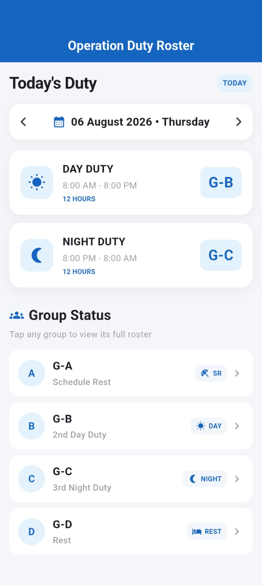

# 📅 Operation Roster

A Flutter-based duty roster management application for managing **day duty, night duty, rest schedules, group rosters, emergency rosters, and person interchange requests**.

## 📥 Download APK

### 🆕 Latest Version — v1.0.2

[⬇️ Download Operation Roster v1.0.2 — ARM64 APK](https://github.com/ashraful00097/operation-roster/releases/download/v1.0.2/app-arm64-v8a-release.apk)

Recommended for most modern Android phones.

### 📦 Previous Version — v1.0.1

[⬇️ Download Operation Roster v1.0.1 — ARM64 APK](https://github.com/ashraful00097/operation-roster/releases/download/v1.0.1/app-arm64-v8a-release.apk)

### 📦 Universal Version — v1.0.0

[⬇️ Download Operation Roster v1.0.0 — Universal APK](https://github.com/ashraful00097/operation-roster/releases/download/v1.0.0/app-release.apk)

Universal APK supports a wider range of Android device architectures.

> **Recommended:** Download v1.0.2 for most modern Android phones.

## ✨ Features

- 📅 Monthly duty roster
- 👥 Group-wise roster
- ☀️ Day duty management
- 🌙 Night duty management
- 🛏️ Rest schedule tracking
- 🚨 Emergency roster management
- 📆 Navigate between dates and months
- 🔵 Automatic highlighting of today's roster
- 👤 User profile management
- 🔄 Shift and Regular duty types
- 🔁 Person Interchange for Shift users
- 🔔 Interchange request notification badge
- 🚫 Person Interchange disabled for Regular users
- 📱 Clean and simple mobile interface

## 👤 Duty Types

### 🔄 Shift

Shift users are assigned to a duty group such as:

- G-A
- G-B
- G-C
- G-D

Shift users can use the **Person Interchange** feature.

### 👤 Regular

Regular users do not have a duty group and do not have access to **Person Interchange**.

## 🛠️ Technology

- Flutter
- Dart
- Firebase Authentication
- Cloud Firestore
- Shared Preferences

## 📌 Latest Update — v1.0.2

- Added Shift / Regular profile system
- Improved Home screen profile information
- Person Interchange available only for Shift users
- Regular users no longer have a duty group
- Improved interchange request notification badge
- UI and stability improvements
## 📱 App Screenshots

<p align="center">
  
  
  
  
</p>

## 🛠️ Built With

- Flutter
- Dart
- Android

## 📂 Project Structure

- `lib/models` — Application data models
- `lib/screens` — Application screens and UI
- `lib/services` — Roster management services

## 🚀 Installation

Clone the repository:

```bash
git clone https://github.com/ashraful00097/operation-roster.git
```

Install dependencies:

```bash
flutter pub get
```

Run the application:

```bash
flutter run
```

## 📦 Release

**Current Version:** v1.0.0

Android APK is available from the **Releases** section.

## 👨‍💻 Developer

Developed by **Ashraful Amin**

---

⭐ If you find this project useful, consider giving the repository a star.
